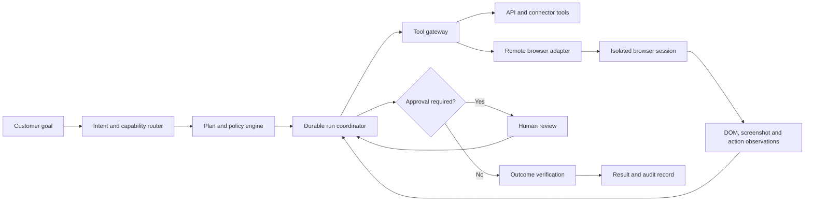

# AI360 Browser and Computer Use Architecture

Status: Phase 0 deployed; Phase 1 read-only worker implemented and disabled pending provider configuration  
Research date: 9 August 2026

## Rollout status

| Phase | State | What is available |
| --- | --- | --- |
| 0. Contracts and safety | Deployed and tested | Normalized tool actions, deterministic risk policy, exact approval receipts, browser-session and action schema, compact truthful activity UI |
| 1. Read-only browser pilot | Worker and recovery path implemented, safely disabled | Provider-neutral Browserbase adapters, isolated Playwright Function, asynchronous invocation and polling, durable actions, domain allowlists, private screenshot evidence, 24-hour default retention, cleanup endpoint, compact stored activity and mobile recovery. Publishing and configuring the worker remains an operator step. |
| 2. Draft and reversible actions | Planned | Typing into forms and preparing uploads without submission |
| 3. Approved external writes | Planned | Exact-action approval, idempotent submit, post-action verification and receipt |
| 4. Remote desktop pilot | Deferred | Internal-only evaluation after browser safety and reliability gates pass |

Phase 0 and the Phase 1 visual observation layer pass the full test suite, lint and the Next.js production build. Migrations `0009_browser_action_foundation.sql` and `0010_browser_artifact_retention.sql` are applied and verified. The worker still fails closed because pilot credentials, the published Function ID, user and domain allowlists, the server-only Storage key and cleanup secret are intentionally absent. No browser or desktop action tool is exposed to a model yet.

## Decision

AI360 should add **browser use first** and treat full desktop computer use as a later, separately permissioned capability.

The browser agent must run in an isolated remote browser. It must never run inside the Next.js request process and must never receive broad access to a customer's device, local files, environment variables or passwords. The model proposes work. A deterministic policy layer decides what is allowed, what needs approval and what is blocked. A separate browser operator executes allowed actions and returns observations. Every consequential action is verified and recorded.

AI360 should not expose raw chain of thought. The customer should see concise, truthful activity summaries derived from real system events, such as "Opening the pricing page", "Comparing three plans" and "Waiting for your approval". A collapsed activity record can expose actions, evidence and verification after completion.

## Why this is the right direction

The common architecture across OpenAI, Anthropic, Google, Microsoft, AWS and leading Chinese GUI-agent research is an observation and action loop:

1. Capture the current environment state.
2. Ask the model for the next bounded action.
3. apply deterministic policy and approval checks.
4. Execute inside an isolated environment.
5. Capture the new state and verify the outcome.
6. Continue until complete, blocked, cancelled or over budget.

OpenAI documents three valid harnesses: its built-in computer tool, a custom automation harness, and a code-execution harness that can mix DOM and visual interaction. Anthropic and Google describe the same screenshot, action and screenshot loop. ByteDance's UI-TARS separates the GUI agent from a replaceable operator with `screenshot()` and `execute()` methods. Qwen's newer research combines GUI operations with CLI execution and long-running stateful workflows.

The strategic lesson is not to couple AI360 to one model's action schema. The durable AI360 run, policy engine, approval model, event log and browser session should remain ours. Provider-specific model outputs should be normalized through adapters.

## Capability ladder

Use the cheapest and most reliable capability that can complete each step:

| Priority | Capability | Use when | Why |
| --- | --- | --- | --- |
| 1 | Direct API or connector | A supported service exposes a structured API | Fastest, cheapest, easiest to validate |
| 2 | DOM and accessibility browser tools | The web page has stable semantic controls | More reliable and data-efficient than pixels |
| 3 | Visual browser use | Canvas, unusual widgets or missing semantics block DOM interaction | Handles interfaces a person can see but code cannot address cleanly |
| 4 | Remote desktop use | A necessary workflow leaves the browser | Broadest capability and highest risk, so introduce last |

Computer vision is a fallback, not the default for every click. The operator should switch between DOM inspection and screenshots without changing the durable run contract.

## Proposed architecture



### 1. Control plane

The existing Next.js application remains the customer-facing control plane. It authenticates the workspace, accepts the goal, creates a durable run, streams stored events and receives approvals. It does not own a live browser process.

### 2. Durable coordinator

Move action-capable runs from the current request-bound agent stream into a durable workflow. Vercel Workflow is the best initial fit because AI360 already deploys on Next.js and Vercel, and its workflow model supports persisted steps, retries, cancellation and approvals that survive refreshes. Supabase remains the authoritative business store for runs, approvals, usage, outcomes and audit records.

Each model call, browser action, approval and verification is one idempotent step. A retry must reuse the same idempotency key and must not repeat an external write.

### 3. Tool gateway

Create one provider-neutral registry. Every tool declares:

- capability: read, navigate, type, upload, download or external write
- risk: passive, reversible, consequential or prohibited
- allowed domains and data scopes
- whether fresh approval is required
- cost and step limits
- input and output schemas
- redaction and retention rules

The model never receives tools that the current task does not need.

### 4. Browser operator

Define an adapter with stable AI360 methods such as:

- `openSession`
- `observeDom`
- `observeScreenshot`
- `navigate`
- `click`
- `type`
- `scroll`
- `uploadApprovedFile`
- `downloadArtifact`
- `liveView`
- `closeSession`

For the pilot, use a managed isolated Chromium provider with Playwright over CDP, live view, session limits and replay. Browserbase is a good pilot candidate because it supports embedded live view, human takeover and automatic session recording. Keep the adapter portable and benchmark Cloudflare Browser Run before general availability.

### 5. Model adapters

Normalize provider outputs into one action protocol:

```text
observe | navigate | click | type | scroll | wait | ask_user | request_approval | finish
```

Start with one supported model path. Keep adapters for OpenAI computer use, Anthropic computer use, Gemini computer use and compatible open GUI models isolated from the coordinator. The coordinator owns limits and state, not the provider.

### 6. Policy and approval boundary

Approval is required immediately before:

- sending a message, publishing or submitting a form
- entering personal, financial or secret data
- signing in or changing an account
- buying, booking, paying or agreeing to terms
- deleting, cancelling or changing access
- uploading a customer file to a new party

An approval receipt must bind the exact action type, destination, important fields, run ID, payload hash and expiry. Editing the action invalidates the approval. The model cannot approve its own proposal.

Web pages, documents, email, chat messages, tool output and screenshots are untrusted content. On-screen text cannot grant permission or change policy. Navigation uses an allowlist for production pilots, with network egress restrictions as the enforcement layer.

### 7. Credentials

Do not ask customers to paste passwords into AI360 chat. The initial pilot should support public websites and customer takeover for sign-in. Later, add scoped OAuth or a credential broker that injects secrets directly into the isolated browser without placing them in model context, logs or screenshots.

### 8. Trace and evidence

Persist semantic events instead of raw model prose:

```text
run.started
plan.created
browser.session_started
page.opened
action.proposed
approval.requested
approval.granted
action.executed
outcome.verified
run.completed
```

Store screenshots and recordings separately in private object storage with short retention. Store hashes and redacted event metadata in the durable run. Never put base64 screenshots into the main Postgres event rows.

## Activity UI decision

### Remove the large simulated thinking card

The current chat placeholder cycles through "Focused analysis", "Useful exploration", "Clear synthesis" and "Final polish" on a timer. Those labels are not tied to real backend events, so they look impressive but do not prove what the system is doing. The large card also competes with the answer.

Replace it with a single compact live row:

```text
Working...                                      Stop
```

When a real tool runs, use its event:

```text
Checking current sources...                    Activity
Opening expresspaygh.com...                    Take over
Waiting for your approval...                   Review
```

The `Activity` control opens a compact drawer. While running it shows only the current step and completed milestones. After completion it collapses to a one-line summary such as `Completed 6 steps in 48 seconds`.

For browser work, show the live browser only when the customer opens it, when approval is required, or when the agent asks for takeover. On mobile, this becomes a full-screen sheet. Do not continuously stream a large viewport beneath the chat.

### Do not show raw thinking

Raw chain of thought is not a reliable audit log and should not be presented as one. OpenAI explicitly keeps raw chain of thought hidden. Anthropic and Gemini expose summarized thinking or encrypted reasoning state, not a guarantee that raw internal reasoning should be shown to end users.

AI360 should expose three safer things:

1. **Plan:** what the system intends to do.
2. **Activity:** what tools and pages it actually used.
3. **Why this action:** a short model-provided intent or server-generated explanation for consequential steps.

Call the panel `Activity`, not `Thinking`. Never invent activity with a client timer. If a provider offers a reasoning summary, normalize it as optional `reasoning.summary` metadata, label it `Approach`, keep it collapsed and do not use it as proof that an action occurred.

## African and Ghanaian adaptation

Browser agents built only for stable desktop broadband will feel broken for many of the people AI360 intends to serve. GSMA reports that Africa still has a large mobile internet usage gap, with affordability and digital skills remaining major barriers.

The implementation must therefore:

- persist every meaningful step so a dropped mobile connection does not restart work
- send semantic events by default and load live video or screenshots only on demand
- use compressed thumbnails and responsive live view
- keep the customer interface useful on a 360 pixel viewport
- display time and credit ceilings before the run starts
- pause safely when the customer goes offline during approval
- write approval prompts in plain language and the customer's selected language
- never auto-confirm Mobile Money, payment, banking or identity actions
- offer a takeover path for OTP, CAPTCHA, sign-in and sensitive form fields
- retain a usable result even if the visual session has expired

## Phased implementation

### Phase 0: contracts and threat model

- Define the normalized tool, observation, action, approval and event schemas.
- Add risk classification, domain policy and approval receipt validation.
- Create a threat model for prompt injection, data exfiltration, confused-deputy actions, credential leakage, replay and cost exhaustion.
- Add evaluation fixtures before connecting a live browser.

Exit gate: policy tests demonstrate that a model cannot expand scope, reuse stale approval or treat page content as permission.

### Phase 1: read-only browser pilot

- Add a `BrowserSessionProvider` interface and one managed Playwright adapter.
- Permit public browsing, navigation, DOM reads, screenshots and downloads only.
- Add compact real activity events and the on-demand live view.
- Add hard limits for domains, steps, duration, screenshots, downloads and credits.
- Store results and citations in the existing durable conversation model.

Exit gate: at least 80 percent success on a representative read-only task set, zero external writes, complete replayable traces and recovery after refresh.

### Phase 2: reversible browser actions

- Add form filling, draft creation and file upload to approved domains.
- Keep final submission disabled.
- Add human takeover for authentication, CAPTCHA, OTP and ambiguous controls.
- Add pre-action and post-action screenshots with deterministic verification.

Exit gate: the agent never submits or publishes during the draft-only evaluation suite and successfully resumes after takeover.

### Phase 3: approved external writes

- Add narrowly scoped submit, send and publish tools.
- Bind each approval to a payload hash and destination.
- Add idempotency records, postcondition verification, receipts and compensation guidance.
- Start with one or two high-value workflows, not open-ended internet access.

Good first workflows are updating a Google Business profile draft, preparing a social post in a supported business tool, or completing a non-payment business form after review.

Exit gate: 100 percent approval coverage for consequential actions, no duplicate writes under retry and complete audit receipts.

### Phase 4: remote desktop research pilot

- Add a separate `DesktopSessionProvider` behind a feature flag.
- Use disposable least-privilege VMs with no host mounts.
- Pilot with internal staff only and no financial or identity workflows.
- Evaluate a frontier hosted model and one open Chinese GUI model through the same action protocol.

Exit gate: desktop use beats browser or API alternatives on a defined workflow while meeting the same security and recovery standards.

## Evaluation scorecard

Measure complete task outcomes, not whether the model produced plausible clicks:

| Metric | Pilot target |
| --- | --- |
| Task success | At least 80 percent on allowed read-only workflows |
| Unsafe action rate | 0 consequential actions without approval |
| Duplicate write rate | 0 under retries and reconnection |
| Prompt injection escape | 0 in the release gate suite |
| Recovery | 100 percent of checkpointed runs reconstruct after refresh |
| Verification | Every completed action has a checked postcondition |
| Mobile data | Activity view works without loading live video |
| Cost | Hard per-run ceiling displayed before execution |
| Latency | First truthful activity event within two seconds |
| Takeover | Customer can pause or take control at any step |

Use BrowserGym, WebArena, OSWorld and custom Ghanaian business workflows as references, but release decisions must be based on AI360's own tasks, languages, networks and risk profile.

## What changes in the current codebase

- `src/lib/agent/runtime.ts`: stop expanding the current research runtime into an unbounded operator. Introduce a separate durable action-capable coordinator.
- `src/lib/agent/protocol.ts`: extend the event model with observations, proposed actions, approvals, verification and checkpoints.
- `src/lib/live-tools.ts`: evolve into a provider-neutral capability registry rather than adding browser actions to the existing search array.
- `src/app/api/action/route.ts`: replace the current boolean `approved` contract with durable, scoped approval receipts before real external writes are introduced.
- `src/app/app/page.tsx`: replace timer-generated activity adjectives with compact event-driven status and an expandable Activity drawer.
- `src/lib/agent/store.ts`: persist browser session references, action events, approval hashes, verification results and terminal reasons.
- Add a separate browser adapter and durable workflow boundary. Do not start Chromium inside a Vercel route handler.

## Sources

- [OpenAI computer use guide](https://developers.openai.com/api/docs/guides/tools-computer-use)
- [OpenAI on hidden chain of thought](https://openai.com/index/learning-to-reason-with-llms/)
- [Anthropic computer use tool](https://platform.claude.com/docs/en/agents-and-tools/tool-use/computer-use-tool)
- [Anthropic containment engineering](https://www.anthropic.com/engineering/how-we-contain-claude)
- [Google Gemini computer use](https://ai.google.dev/gemini-api/docs/computer-use)
- [Google Gemini thought summaries](https://ai.google.dev/gemini-api/docs/thinking)
- [ByteDance UI-TARS Desktop SDK](https://github.com/bytedance/UI-TARS-desktop/blob/main/docs/sdk.md)
- [UI-TARS research paper](https://arxiv.org/abs/2501.12326)
- [Qwen UI Agent technical report](https://arxiv.org/abs/2607.28227)
- [Qwen-Agent framework](https://qwenlm.github.io/Qwen-Agent/en/guide/)
- [Vercel WorkflowAgent](https://vercel.com/kb/guide/what-is-workflowagent)
- [Browserbase live view](https://docs.browserbase.com/platform/browser/observability/session-live-view)
- [Cloudflare Browser Run sessions](https://developers.cloudflare.com/browser-run/features/reuse-sessions/)
- [AWS AgentCore Browser](https://docs.aws.amazon.com/bedrock-agentcore/latest/devguide/browser-tool.html)
- [GSMA Mobile Economy Africa 2025](https://www.gsma.com/solutions-and-impact/connectivity-for-good/mobile-economy/africa-2025/)
- [World Bank Digital Progress and Trends Report 2025](https://www.worldbank.org/en/publication/dptr2025-ai-foundations/report)
