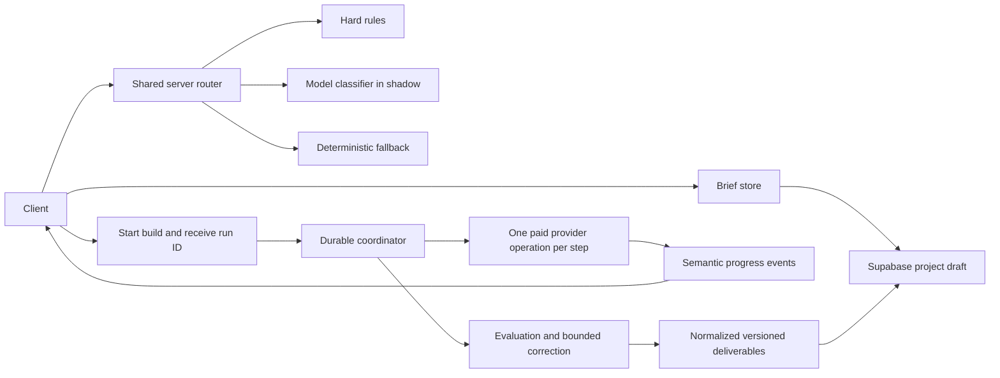

# Recoverable work and evaluated routing

Last reviewed: 9 August 2026

## Decision

AI360 treats the browser as a viewer and controller, not as the owner of paid work. A project brief is persisted before production starts. A project build receives a durable run ID before the first provider call. Progress is stored as small semantic events and can be replayed from a cursor after a refresh, device change or dropped connection.

The first-turn router has three layers:

1. Hard product and safety rules.
2. A structured model classifier for genuinely ambiguous requests.
3. A deterministic fallback during provider or database failure.

The classifier starts in shadow mode. It cannot redirect a customer until it passes a labelled evaluation set that includes Ghanaian English, imperfect spelling, code-switching, local business terms, attachments and requests whose facts change over time.

## Why this shape

Durable execution systems converge on event history, independently retryable steps and idempotent side effects. Inngest persists and memoizes completed steps. Vercel Workflow persists an event log and runs steps as separate invocations. Cloudflare Durable Objects documents at-least-once alarms and requires idempotent handlers. Trigger.dev supports stream resumption and idempotent chunks. These products express the same constraint: a network stream is presentation, not execution ownership.

Routing research points in the same direction. Anthropic recommends routing when categories are distinct and classification can be measured. RouteLLM learns quality and cost trade-offs from preference data. FrugalGPT shows the value of cascades. Confidence-token research warns that a model saying it is confident is not calibration. AI360 evaluates observed decisions and user corrections instead of trusting a confidence number generated in the same response.

## African operating context

GSMA reports a large mobile internet usage gap across Africa, with affordability and digital skills among the constraints. The World Bank identifies gaps in connectivity, compute, data and skills. AfroBench finds large performance gaps between English and many African languages.

For AI360 this changes implementation details:

- Reconnection uses a run ID and a small event cursor, not a replay of every token.
- Brief text saves locally first and synchronizes when a signed-in connection is available.
- Mutations carry idempotency keys so mobile retries do not reserve credits twice.
- Router evaluation is sliced by language, code-switching, location, request length and spelling quality.
- The deterministic fallback never depends on a second model or a live connection.
- Consequential actions still require human approval.

## Target architecture

## Execution contract

Every durable build must satisfy all of these before rollout:

- The start endpoint returns a stable run ID immediately.
- The run belongs to the authenticated workspace and cannot be read across workspaces.
- One paid provider operation is one durable step.
- A completed step is memoized and cannot be charged again during replay.
- External side effects use an idempotency key.
- Credit reservation happens before the run starts and settlement is safe to repeat.
- Progress events are append-only, ordered and bounded in size.
- A reconnect can request events after cursor N.
- The final result is normalized into the existing Studio project model.
- A stale or incompatible workflow version fails visibly and releases the unused reservation.

## Current implementation

Completed in this slice:

- `lab_studio_drafts` stores unfinished briefs independently of completed projects.
- Guest briefs save to workspace-scoped local storage.
- Signed-in briefs reconcile the newest local or cloud copy.
- Brief turns, extracted intake, selected internal project type and unsent text recover after refresh.
- `/api/route-intent` is the shared first-turn boundary.
- Clear requests use the deterministic path without a model call.
- Ambiguous requests can run through the model in `shadow` mode via `AI360_ROUTER_MODE=shadow`.
- Logs store only a short SHA-256 prompt fingerprint and routing metadata, not the prompt.
- `active` mode exists as an explicit rollout switch but must not be enabled before the evaluation gate passes.

Not yet claimed as complete:

- Studio production still runs inside the initiating request stream.
- The agent run store preserves progress and results, but the current runtime is not yet an independently scheduled worker.
- Vercel Workflow is the preferred adapter for the current Vercel deployment, but it must not be installed until specialist calls are decomposed into step-safe operations. A package review on 9 August 2026 showed a large transitive dependency increase. We removed the unused package instead of carrying risk without the reliability benefit.

## Router evaluation gate

Start with at least 300 manually labelled first turns, then keep a locked test set. Include direct answers, current research, durable projects, supported languages, code-switching, spelling noise, attachments, URLs and ambiguous prompts.

Do not activate model routing until:

- overall macro F1 is at least 0.90;
- no critical slice is below 0.82 recall;
- current-information recall is at least 0.95;
- project false-positive rate is below 5 percent;
- p95 added routing latency stays below 800 ms;
- cost per routed first turn fits the published credit economics;
- deterministic fallback tests pass with the model and database unavailable.

## Durable build rollout

1. Extract each specialist provider call from `runPack` into a serializable step contract.
2. Add project kind, workflow version, reservation ID and ordered cursor to the run repository.
3. Implement the Vercel Workflow adapter behind a coordinator interface.
4. Change `/api/studio/pack` to reserve credits, create the run and return its ID.
5. Add a workspace-scoped status endpoint and cursor-based event replay.
6. Store the active run ID inside the project draft before navigation.
7. Normalize the result server-side and clear the draft only after that transaction succeeds.
8. Run kill tests after every specialist boundary, during correction, settlement and final project creation.
9. Convert Research to the same adapter after Studio proves the contract.

## Primary references

- [Anthropic, Building effective agents](https://www.anthropic.com/engineering/building-effective-agents)
- [Anthropic, Demystifying evals for AI agents](https://www.anthropic.com/engineering/demystifying-evals-for-ai-agents)
- [Vercel, a programming model for durable execution](https://vercel.com/blog/a-new-programming-model-for-durable-execution)
- [Vercel, durable web research agent with Workflow SDK](https://vercel.com/kb/guide/durable-web-research-agent-with-workflow-sdk)
- [Inngest, how functions are executed](https://www.inngest.com/docs/learn/how-functions-are-executed)
- [Trigger.dev, task streams](https://trigger.dev/docs/tasks/streams)
- [Cloudflare, Durable Object alarms](https://developers.cloudflare.com/durable-objects/api/alarms/)
- [RouteLLM](https://arxiv.org/abs/2406.18665)
- [FrugalGPT](https://arxiv.org/abs/2305.05176)
- [Confidence is all you need](https://arxiv.org/abs/2410.13284)
- [GSMA, Mobile Economy Africa 2025](https://www.gsma.com/solutions-and-impact/connectivity-for-good/mobile-economy/africa-2025/)
- [World Bank, AI foundations](https://www.worldbank.org/en/publication/dptr2025-ai-foundations/report)
- [AfroBench, ACL 2025](https://aclanthology.org/2025.findings-acl.976/)
