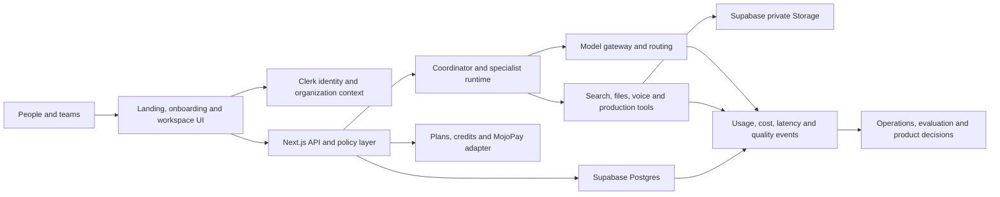

# AI 360 system architecture and quality budgets

Last reviewed: 2026-08-04

## Operating principle

AI 360 improves one layer at a time while keeping the whole outcome visible.
Every feature proposal must answer:

1. Why does this improve a user outcome?
2. Which system layer owns it?
3. What security, cost, latency and reliability budget does it consume?
4. How will we measure success before expanding it?
5. What scale signal triggers the next architecture step?

Performance, accessibility, observability, security and cost are acceptance
criteria from the first implementation. They are not a cleanup phase after the
product is finished.

## System map

## Layer-by-layer architecture

| Layer | Why it exists | Current foundation | Target and scale trigger |
| --- | --- | --- | --- |
| Product experience | Turn goals into completed work for technical and non-technical people | Landing, Chat, Agent, Studio, pricing, responsive UI | Instrument funnel and accessibility; split bundles only when users cannot find the right workflow |
| Identity and tenancy | Give every private record and cost a trusted owner | Clerk users, personal workspace and optional Organizations | Add tenant-isolation tests before team launch; upgrade Clerk only when security or B2B limits require it |
| API and policy | Keep secrets, entitlements and ownership decisions on the server | Next.js routes, request IDs, validation and readiness checks | Extract services only when independent scaling or deployment cadence is measured, not anticipated |
| Agent runtime | Make multi-step work durable, bounded and explainable | Fixed plan/execute/verify pipeline with schema-level tool isolation, per-run cost and deadline ceilings, and runs, tasks, events and artifacts persisted at each boundary | Add a queue and worker so a run survives process restart; add task dependencies and approvals when work becomes side-effecting |
| Model gateway | Balance quality, latency and cost without vendor lock-in | OpenRouter model selection and usage logging | Route by capability and provider health; add model eval gates before changing defaults |
| Tools and retrieval | Ground answers and execute useful work | Web research, uploads, voice, image, video and exports | Add permissioned tool registry, malware scanning and prompt-injection isolation before broad connectors |
| Data | Preserve truth, ownership, state and billing evidence | Supabase-ready Postgres schema with RLS and indexes | Cut routes from MySQL repository by repository; partition only after table and query metrics justify it |
| Asset storage | Store large private files outside relational tables | Private Supabase bucket defined; metadata schema prepared | Signed URLs, lifecycle rules, checksums and CDN; separate hot and archival retention when storage cost warrants it |
| Billing and payments | Convert variable AI cost into understandable access | Versioned plans, payment attempts, subscriptions and ledger | MojoPay signed webhooks, atomic reservations and reconciliation before enabling checkout |
| Observability and evaluation | Detect failures and prove that changes improve outcomes | Request, token, cost and latency logging | Central tracing, alerts, product analytics and representative eval suite before public scale |
| Security and governance | Protect people, organizations, prompts and money | CSP, RLS, server ownership checks and approval boundaries | Threat modelling, dependency scanning, incident playbook, data retention and external security review |
| Platform and delivery | Release safely and recover quickly | Hostinger Node deployment, health/readiness and preflight | Staging, automated migrations, rollback and load tests; move jobs to workers before long runs threaten web capacity |

## Initial quality budgets

These are engineering targets for the pilot. Measure from Ghanaian mobile and
broadband networks, not only from a developer laptop.

| Quality | Pilot target | Measurement |
| --- | --- | --- |
| Landing performance | LCP under 2.5 seconds at p75; CLS under 0.1 | Real-user web vitals |
| Non-AI API latency | p95 under 500 ms | Server route traces |
| Fast-chat feedback | Visible sending state under 100 ms; first streamed content p95 under 4 seconds | Client and provider timing |
| Agent feedback | Durable run created and first meaningful status within 2 seconds | Agent event timestamps |
| Database | Common indexed reads p95 under 100 ms inside the backend region | Query telemetry and `pg_stat_statements` |
| Availability | 99.9% monthly for core signed-in workspace after launch | External uptime and readiness checks |
| Provider-call accounting | 100% of paid calls have request ID, owner, outcome and actual or estimated cost | Usage reconciliation |
| Job reliability | At least 95% completion excluding user cancellation and safety refusal | Durable run states |
| Tenant isolation | Zero known cross-workspace reads or writes | Automated isolation suite and audit logs |
| Billing correctness | Zero duplicate grants; every ledger mutation idempotent | Payment and ledger reconciliation |
| Recovery | Pilot RPO 24 hours and RTO 4 hours, improved after restore rehearsal | Backup and restore test |
| Accessibility | WCAG 2.2 AA contrast, keyboard flow and 200% text zoom for core journeys | Automated and manual review |

## Data boundaries

- Clerk is the identity and session authority.
- Supabase Postgres is the durable application truth.
- Supabase Storage holds private binaries; Postgres holds metadata and ownership.
- MojoPay confirms money movement; AI 360 owns plans, entitlements and the
  append-only credit history.
- OpenRouter and media providers execute model work; AI 360 owns routing,
  budgets, user approvals and usage evidence.
- Browser storage is guest recovery, never the authoritative signed-in record.

## Scaling rules

- Scale vertically first while queries and connection pools remain efficient.
- Add indexes from observed query plans, not from every imaginable filter.
- Keep the Hostinger application on the Supabase session pooler with a small
  application pool. Use transaction pooling for future short-lived serverless
  workloads.
- Add a durable queue before enabling long-running background agents for the
  public. Web requests should create work, not remain the work container.
- Introduce caching only with an owner, privacy classification, invalidation
  rule and hit-rate metric.
- Split a service only when it needs a different security boundary, independent
  scaling profile or failure isolation.
- Compare single-agent and multi-agent quality, cost and latency. More agents
  are justified only when they measurably improve completion.

## Review rhythm

- Every pull request: tests, accessibility, security, query and cost impact.
- Weekly during pilot: error rate, p50/p95 latency, model cost, payment failures
  and incomplete outcomes.
- Monthly: plan margins, retention, provider routing, database growth and backup
  restore evidence.
- Before each phase gate: threat model, load test, tenant isolation and rollback
  rehearsal proportional to the change.
