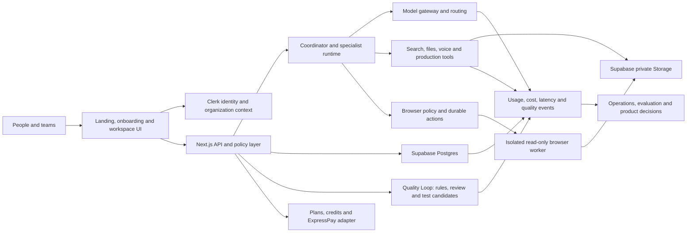
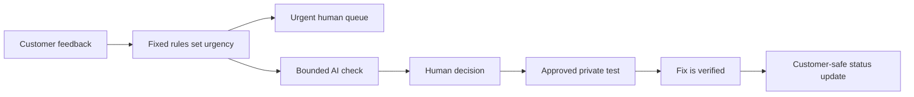

# AI360 system architecture and quality budgets

The recovery and evaluated-routing design, including rollout gates, is maintained in [RECOVERABLE_EXECUTION_ARCHITECTURE.md](./RECOVERABLE_EXECUTION_ARCHITECTURE.md).

Last reviewed: 2026-08-08

## Operating principle

AI360 improves one layer at a time while keeping the whole outcome visible.
Every feature proposal must answer:

1. Why does this improve a user outcome?
2. Which system layer owns it?
3. What security, cost, latency and reliability budget does it consume?
4. How will we measure success before expanding it?
5. What scale signal triggers the next architecture step?

Performance, accessibility, observability, security and cost are acceptance
criteria from the first implementation. They are not a cleanup phase after the
product is finished.

## Composability standard

The smallest useful part is not the smallest possible file. It is the smallest
unit with one reason to change, a clear input/output contract and a focused way
to verify it.

| Part | Owns | Must not own |
| --- | --- | --- |
| Content registry | Product language, labels, links and outcome definitions | Rendering state or provider calls |
| UI section | One visible user idea and its interactions | Cross-page policy or data persistence |
| Route handler | HTTP validation, identity, limits and response translation | Provider-specific business logic or SQL orchestration |
| Application service | One complete use case and its policy sequence | Framework request/response objects |
| Provider adapter | Authentication, request shape, timeout and provider response normalization | Product pricing or workspace authorization |
| Repository | One durable aggregate and its atomic invariants | UI language or provider behavior |
| Pure policy module | Routing, pricing, permissions or state transition decisions | I/O of any kind |

Optimize in that same order of scope:

1. Make the component contract correct and observable.
2. Remove unnecessary work inside that component.
3. Measure the complete user flow that composes those parts.
4. Optimize cross-layer latency, cost and reliability only after the slow or
   fragile boundary is known.
5. Change system topology only when measurements justify a new deployment or
   failure boundary.

The public UI now follows this shape: shared brand content and links,
independent hero/mission/proof/outcome/process sections, and one shared public
footer. Studio now has separate registry, coordinator, evaluator and normalized
project-model boundaries, but its large client workspace should be split by
dashboard, intake, progress and project views next. The export route follows,
then a shared OpenRouter adapter for duplicated headers,
timeouts, error normalization and usage capture. These refactors should preserve
the existing route contracts and be completed one boundary at a time.

## System map

## Layer-by-layer architecture

| Layer | Why it exists | Current foundation | Target and scale trigger |
| --- | --- | --- | --- |
| Product experience | Turn goals into completed work for technical and non-technical people | Landing, Chat, Agent, Studio, pricing, responsive UI | Instrument funnel and accessibility; split bundles only when users cannot find the right workflow |
| Identity and tenancy | Give every private record and cost a trusted owner | Clerk users, personal workspace and optional Organizations | Add tenant-isolation tests before team launch; upgrade Clerk only when security or B2B limits require it |
| API and policy | Keep secrets, entitlements and ownership decisions on the server | Next.js routes, request IDs, validation and readiness checks | Extract services only when independent scaling or deployment cadence is measured, not anticipated |
| Agent runtime | Make multi-step work durable, bounded and explainable | Research uses a fixed plan/execute/verify pipeline with durable boundaries. Create uses registry-defined stages, real parallel specialists, deterministic evaluation and one bounded correction pass | Persist Create pack runs and events so a project can recover after disconnection; add a queue and worker so work survives process restart |
| Model gateway | Balance quality, latency and cost without vendor lock-in | OpenRouter model selection and usage logging | Route by capability and provider health; add model eval gates before changing defaults |
| Tools and retrieval | Ground answers and execute useful work | Web research, uploads, voice, image, video, exports and a disabled read-only browser pilot with isolated execution | Publish and evaluate the browser worker before model routing; add interaction only after the read-only exit gate passes |
| Data | Preserve truth, ownership, state and billing evidence | Supabase Postgres is the only data plane, with RLS, indexes and runtime repositories | Verify production-host connectivity and tenant isolation; partition only after table and query metrics justify it |
| Asset storage | Store large private files outside relational tables | Private Supabase storage adapter, browser evidence hashes, authenticated streaming and expiry cleanup | Add lifecycle monitoring and separate hot and archival retention when measured storage cost warrants it |
| Billing and payments | Convert variable AI cost into understandable access | Versioned plans, durable payment attempts, hosted ExpressPay checkout, query-verified activation, subscriptions and an append-only ledger | Pass the sandbox matrix, add scheduled reconciliation and enable production credentials only after operational approval |
| Observability and evaluation | Detect failures and prove that changes improve outcomes | Request, token, cost and latency logging | Central tracing, alerts, product analytics and representative eval suite before public scale |
| Customer quality | Turn feedback into evidence, accountable decisions and regression tests | Opt-in evidence, rule-first severity, bounded AI evaluation, private receipts and a human Quality Desk | Measure acknowledgement and verification time; add durable alert delivery and benchmark execution before public scale |
| Security and governance | Protect people, organizations, prompts and money | CSP, RLS, server ownership checks and approval boundaries | Threat modelling, dependency scanning, incident playbook, data retention and external security review |
| Platform and delivery | Release safely and recover quickly | Hostinger Node deployment, health/readiness and preflight | Staging, automated migrations, rollback and load tests; move jobs to workers before long runs threaten web capacity |

## Initial quality budgets

These are engineering targets for the pilot. Measure from Ghanaian mobile and
broadband networks, not only from a developer laptop.

| Quality | Pilot target | Measurement |
| --- | --- | --- |
| Landing performance | LCP under 2.5 seconds at p75; CLS under 0.1 | Real-user web vitals |
| Non-AI API latency | p95 under 500 ms | Server route traces |
| Fast-chat feedback | Visible sending state under 100 ms; first streamed content p95 under 4 seconds | Client and provider timing |
| Agent feedback | Durable run created and first meaningful status within 2 seconds | Agent event timestamps |
| Database | Common indexed reads p95 under 100 ms inside the backend region | Query telemetry and `pg_stat_statements` |
| Availability | 99.9% monthly for core signed-in workspace after launch | External uptime and readiness checks |
| Provider-call accounting | 100% of paid calls have request ID, owner, outcome and actual or estimated cost | Usage reconciliation |
| Job reliability | At least 95% completion excluding user cancellation and safety refusal | Durable run states |
| Tenant isolation | Zero known cross-workspace reads or writes | Automated isolation suite and audit logs |
| Billing correctness | Zero duplicate grants; every ledger mutation idempotent | Payment and ledger reconciliation |
| Recovery | Pilot RPO 24 hours and RTO 4 hours, improved after restore rehearsal | Backup and restore test |
| Accessibility | WCAG 2.2 AA contrast, keyboard flow and 200% text zoom for core journeys | Automated and manual review |
| Quality response | S0 acknowledgement under 15 minutes during staffed pilot hours; all other reports under one business day | Quality event timestamps and reviewer queue |

## Quality Loop

The AI check may summarize, classify and propose a test or fix. It cannot lower
the rules-first urgency, contact a customer, pause a capability, publish a fix
or close a serious case. Message content and contact details are opt-in. Review
receipts expose only customer-safe events; operational evidence stays behind
reviewer authorization.

## Data boundaries

- Clerk is the identity and session authority.
- Supabase Postgres is the durable application truth.
- Supabase Storage holds private binaries; Postgres holds metadata and ownership.
- ExpressPay confirms money movement; AI360 owns plans, entitlements and the
  append-only credit history.
- OpenRouter and media providers execute model work; AI360 owns routing,
  budgets, user approvals and usage evidence.
- Browser storage is guest recovery, never the authoritative signed-in record.

## Scaling rules

- Scale vertically first while queries and connection pools remain efficient.
- Add indexes from observed query plans, not from every imaginable filter.
- Keep the Hostinger application on the Supabase session pooler with a small
  application pool. Use transaction pooling for future short-lived serverless
  workloads.
- Add a durable queue before enabling long-running background agents for the
  public. Web requests should create work, not remain the work container.
- Introduce caching only with an owner, privacy classification, invalidation
  rule and hit-rate metric.
- Split a service only when it needs a different security boundary, independent
  scaling profile or failure isolation.
- Compare single-agent and multi-agent quality, cost and latency. More agents
  are justified only when they measurably improve completion.

## Review rhythm

- Every pull request: tests, accessibility, security, query and cost impact.
- Weekly during pilot: error rate, p50/p95 latency, model cost, payment failures
  and incomplete outcomes.
- Monthly: plan margins, retention, provider routing, database growth and backup
  restore evidence.
- Before each phase gate: threat model, load test, tenant isolation and rollback
  rehearsal proportional to the change.
# Voice and language subsystem

The production voice boundary is a provider-neutral cascade: capture, binary upload, spoken-language context, transcription routing, human transcript review, AI reasoning, and optional tested speech output. Spoken language and answer language are separate product settings. Provider adapters, evaluation gates, privacy rules and the staged roadmap are defined in `VOICE_LANGUAGE_ARCHITECTURE.md`.
