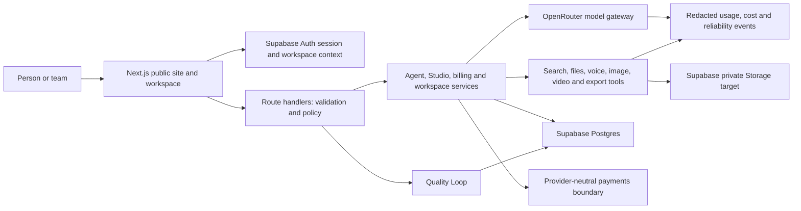
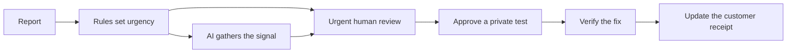
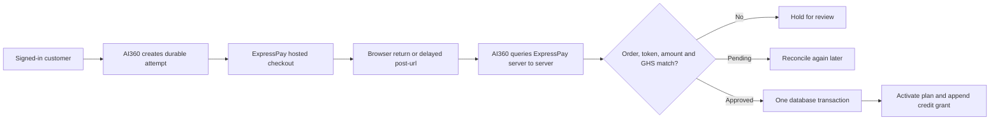

# AI360 technical handbook

For unfinished brief recovery, shared intent routing, African connectivity constraints and the durable coordinator rollout, read [RECOVERABLE_EXECUTION_ARCHITECTURE.md](./RECOVERABLE_EXECUTION_ARCHITECTURE.md).

For the layer-by-layer path from a person’s words to a checked result, read [CONTEXT_ENGINEERING.md](./CONTEXT_ENGINEERING.md).

Last reviewed: 2026-08-21

This is the canonical entry point for engineers and operators picking up AI360
Lab. It explains what the product is, how the system is divided, how work moves
through it and how to verify a safe release. It does not turn planned work into
shipped work.

## 1. Product and release truth

AI360 is a practical AI workspace for people and teams who need to research
current information, understand difficult material, make a decision, prepare a
document or produce coordinated campaign assets. AI360 Studio is the creative
production mode inside the Lab.

Use these names consistently:

| Meaning                | Canonical name |
| ---------------------- | -------------- |
| Organization and brand | AI360          |
| Product                | AI360          |
| Creative workspace     | AI360 Studio   |

The current release state is a **live private pilot with verified prepaid
payments**. Paid checkout is enabled in production: a real ExpressPay Mobile
Money purchase was verified end to end on 2026-08-14, one-time top-ups shipped
on 2026-08-15, and Media Studio image generation is verified in production
with video reliability fixes deployed pending a final render retest.
Unrestricted public launch remains gated by shared rate limiting, durable
background replay, external monitoring and the unproven payment failure paths
(delayed notification, reversal, refund). The exact checklist lives in
[`PRODUCTION_READINESS.md`](PRODUCTION_READINESS.md).

Three further capabilities shipped 2026-08-20: the discovery catalogue was
renamed from "Market" to **Tools & Kits** and reorganised by job rather than
category; a workspace can now hold its own **Brand Kit** (knowledge and logo,
both workspace-wide) and apply it to generated documents; and chat now
separates a short freshness check from the metered Research workflow, so a
current-facts question gets verified and visibly receipted instead of either
being assumed current or billed as Research. See `DECISIONS.md` for each. On
2026-08-21 the Library entry was removed from the desktop side navigation
(commented out, not deleted) pending a clearer use case; the module itself is
unchanged. Also on 2026-08-21, a project document (Research findings and
similar long outputs) renders as a rail of collapsible sections instead of
one continuous scroll, using the new `motion` package for the collapse
animation, the active-section highlight and scroll-spy; see
`src/components/DocumentReader.tsx` and the 2026-08-21 decision in
`DECISIONS.md`.

When documents disagree, use this authority order:

1. Running code, migrations and passing tests.
2. `PRODUCTION_READINESS.md` for current release status.
3. This handbook for system operation and onboarding.
4. `DECISIONS.md` for why a decision was made and when to revisit it.
5. Specialized architecture, deployment and pricing documents.

Fix contradictions when they are discovered. Do not preserve two competing
descriptions of the same runtime.

## 2. Local setup

Requirements:

- Node.js 22.x, matching `.nvmrc` and `package.json`
- npm
- Provider credentials only for the flow being exercised

```bash
npm install
Copy-Item .env.example .env.local
npm run dev
```

Open `http://localhost:3000`. Guest UI and local browser recovery work without
Supabase Auth. OpenRouter calls require `OPENROUTER_API_KEY`. Signed-in
persistence and credit operations require Supabase Auth and `DATABASE_URL`.
Local-only origin overrides belong in `.env.development.local`; keep secrets in
`.env.local` and production values in the hosting environment.

Before changing Next.js code, read the relevant guide under
`node_modules/next/dist/docs/`. This repository uses Next.js 16 and its APIs and
conventions must not be assumed from an older version.

## 3. System map



The deployable application is currently one Next.js service. Keep code
composable inside that boundary. Split a service only when measured scaling,
security or failure-isolation needs justify another deployment.

## 4. Routes and discoverability

Public, indexable pages:

- `/`: product mission and primary outcomes
- `/what-you-can-make`: representative use cases and output examples
- `/how-it-works`: routing, research, approval and production workflow
- `/pricing`: plans, credits and current checkout availability
- `/changelog`: public, outcome-focused product updates
- `/privacy` and `/terms`: public policies

Private or utility surfaces:

- `/app`: workspace; must remain `noindex, nofollow`
- `/feedback/[reportId]`: private receipt opened with a signed-in identity or one-time browser token
- `/quality`: reviewer-only Quality Desk; must remain `noindex, nofollow`
- `/sign-in` and `/sign-up`: Supabase Auth account flows
- `/api/*`: server routes; never public search results
- `/api/health`: process liveness
- `/api/ready`: release dependencies and configuration readiness

Search and agent discovery are implemented through per-page metadata, canonical
URLs, Open Graph fields, JSON-LD, `robots.txt`, `sitemap.xml` and `llms.txt`.
Update these when a new public page or materially different capability ships.

## 5. Composable architecture

| Layer                     | Owns                                                                      | Primary locations                                                         |
| ------------------------- | ------------------------------------------------------------------------- | ------------------------------------------------------------------------- |
| Brand and product content | Canonical names, public links, plan and outcome definitions               | `src/lib/brand.ts`, registries under `src/lib`                            |
| UI components             | One visible idea, responsive behavior and local interaction               | `src/components`, `src/app/*` pages and CSS modules                       |
| Route handlers            | HTTP parsing, authorization, rate limits and response translation         | `src/app/api`                                                             |
| Application services      | Complete use cases and workflow policy                                    | `src/lib/agent`, `src/lib/studio`, `src/lib/billing`                      |
| Quality policy            | Consent, deterministic urgency, bounded AI evaluation and human decisions | `src/lib/quality`, `src/app/api/feedback`, `src/app/api/quality`          |
| Provider adapters         | Provider request shape, timeout, failover and normalization               | `src/lib/models.ts`, `src/lib/live-tools.ts`, media modules               |
| Repositories              | Durable aggregates and atomic invariants                                  | `src/lib/workspace-db.ts`, agent and billing stores                       |
| Infrastructure            | Database pool, configuration, logs and deployment checks                  | `src/lib/postgres.ts`, `runtime-config.ts`, `observability.ts`, `scripts` |

A component should have one reason to change, an explicit contract and a focused
verification path. Route handlers must not absorb provider policy or SQL
orchestration. Repositories must not contain interface copy. Optimize a layer
only after its behavior is correct and observable, then measure the composed
user flow before changing topology.

## 6. Core flows

### Guest and signed-in work

Guests can explore the workspace and recover supported local work from browser
storage. Supabase Auth is the only identity authority. Signed-in users receive a
personal workspace or an optional organization workspace, and every private
database operation must be scoped to that workspace.

### Chat and research

The route validates the request, resolves identity, applies a limit and selects
a model route. Current-information work can use server-side search tools.
Provider keys and provider routing policy stay on the server. Streams carry
request references so a visible failure can be matched to redacted logs.

### Answer verification

A chat request first passes through `freshnessForPrompt`, which classifies it
`off`, `auto` or `required`. `off` and `auto` proceed like any other chat
turn, with live tools offered when they might help. `required` covers prompts
that depend on mutable real-world facts (a price, a law, a current
officeholder, an availability question); those turns buffer their reply until
at least one supporting source is found, and if none is found the person is
told the claim could not be verified rather than shown an unverified answer.
A separate `deepResearch` classification decides whether the metered Research
workflow is entered at all: a short current-facts question stays inside an
ordinary chat turn and is never billed as Research. The stream carries a
`grounding` event (`checking`, `verified`, `not_needed`, `unavailable`) and
the interface shows a receipt line under the answer, so the check is visible
to the person and not only in server logs. See the 2026-08-20 decision in
`DECISIONS.md`.

### Agent runtime

The agent plans, executes, synthesizes, verifies and may revise within explicit
time and cost ceilings. Runs, tasks, events, artifacts and checkpoints are
written to Postgres at boundaries. State survives a failed request, but work is
not yet replayed automatically after a process restart. A durable queue and
worker are a public-scale gate.

### Read-only browser pilot

Browser work uses a separate execution plane. Next.js creates a durable action,
then invokes the Browserbase Function in `workers/browser-observer`. The worker
receives only the approved URL and domain list. It has no AI360 database,
payment, model or identity secrets. Its Playwright context permits GET and HEAD,
blocks navigation outside the approved domains, disables CAPTCHA solving and
ends after five minutes.

`POST /api/browser/navigate` returns an action ID immediately. The client can
poll `GET /api/browser/navigate/[actionId]` after a refresh or dropped
connection. The completed observation is validated again by AI360. JPEG bytes
are integrity checked, written to a private Supabase bucket and represented in
Postgres only by workspace metadata, SHA-256 and expiry. Authenticated evidence
is streamed through `/api/browser/artifacts/[artifactId]`. The cleanup route
removes expired objects through the Storage API and then marks their metadata
deleted. Base64 images, provider connection URLs and credentials never enter
run events.

The pilot remains disabled until every browser environment value is present.
It is not yet a model tool and it cannot click, type, upload, submit, pay or use
the customer's desktop. See `BROWSER_COMPUTER_USE_IMPLEMENTATION_PLAN.md`.

### Discovery (Tools & Kits)

The `apps` experience (label: Tools & Kits, `src/lib/market-catalog.ts`) is the
plain-language entry point into Studio: a person picks a recognisable job from
`MARKET_PRODUCTS`, and the choice opens the matching Project engine with their
stated intent already carried into the brief. Every listing maps to one of 11
working engines (`packId`); `tests/market-catalog.test.ts` asserts no listing
is decorative. The catalogue was renamed from "Market" on 2026-08-20 because
nothing on the page is bought or sold; see `DECISIONS.md`.

### Studio production

Create reads six project types from `src/lib/studio/packs.ts`. The selected pack
defines its promise, specialist stages, deliverables and estimated credits.
`POST /api/studio/pack` reserves the quoted pack budget once, streams real NDJSON
events, runs dependent stages in sequence and compatible specialists at the
same time, and settles measured cost when the run finishes.

A deterministic evaluator checks every specialist section for minimum
usefulness, unresolved placeholders, document structure and research sources.
At most one correction pass runs for up to two failing sections, inside the
same deadline and reserved budget. `src/lib/studio-project-model.ts` normalizes
the final sections into durable, reviewable and versioned deliverables. Existing
campaign projects remain readable through the older project fields.

Image and video production require a provider-cost confirmation and, in the
branded Studio flow, asset approval. The UI collects a provider-neutral
`MediaIntent`: purpose, channel, shape, quality tier, resolution, length,
movement, audio policy and references. Customers choose outcomes and cost,
never model names. The server validates the exact capability combination
against the live catalogue and routes only within the selected quality tier.

Media Studio generates directly from the person's own words:
`/api/studio/image` and `/api/studio/video` accept a raw `prompt` (with only
light art-direction and execution guardrails) and reuse the same credit gate,
provider loop, durable job and storage paths as the branded flow. Images
generate immediately against the reserve and settle measured cost. Videos
follow the quote-first pattern — the client fetches the live quote, shows the
price in credits, the person confirms, and only then does provider work start.

Video holds are sized from the quoted provider price up to the reserve. A
`completed` job is charged only after the file has actually downloaded and been
persisted to storage; a delivery failure keeps the job running for the next
poll to retry, and `failed`, `cancelled`, `expired` and provider 404 are all
terminal states that refund the hold. The client keeps the job in session
storage, re-hydrates it on mount, retries transient poll failures with
exponential backoff and resumes immediately when the tab regains visibility, so
a refresh or a dropped mobile connection cannot orphan a paid render.

`lab_media_jobs` is the durable boundary for provider work. It stores the
approved intent, project and deliverable identity, quote, credit reservation,
provider job identity and terminal result. `lab_media_outputs` versions the
result separately, while the bytes live in the private Supabase bucket through
`lab_assets`. Provider calls and object uploads happen outside database
transactions; the short final transaction locks one job while assigning its
next output version. After a refresh, Studio reloads jobs by project and resumes
video status checks. The old signed video token remains only as a guest or
database-unavailable fallback.

Generated business text remains outside image pixels so phone numbers, prices
and Ghanaian-language copy stay editable and reviewable. Audio is deliberately
off in the first production slice. Reference-led generation, deterministic
captioning and channel adaptation must land behind the same intent and artifact
contracts rather than adding provider-shaped fields to the UI.

A payment redirect or client response never grants credits. Pack runs still
need durable run IDs and event persistence before a disconnected browser can
recover their final result.

### Brand Kit

A workspace can hold its own brand knowledge (uploaded documents, extracted to
text) and a logo, both scoped to the workspace rather than one project or
conversation, so the same identity applies across every document AI360
generates for it. The logo is stored as an ordinary private asset
(`lab_assets`) and referenced by ID from the brand kit row; brand colours are
optional. `src/lib/export/brand.ts` and `src/lib/export/render.ts` apply
knowledge, logo and colours when a document is exported, and
`src/lib/export/image-dimensions.ts` reads a logo's real pixel dimensions from
its file header so it embeds at the correct aspect ratio. See the 2026-08-20
decision in `DECISIONS.md`.

### Credits

Everyday chat is included: plain chat carries a zero credit weight and is
bounded by per-plan fair-use daily caps (Explorer 10, Everyday 60, Builder 120,
Team 150; anonymous halves to 10) counted in a durable Postgres table keyed by
workspace or IP and UTC date (migration 0017), so a deploy or a second server
instance cannot reset or double the allowance. Past the cap, signed-in users
overflow at a flat 1 credit per message; anonymous callers are hard-stopped
with a sign-in hint. Metered work — live research, files, premium models (a 2×
multiplier on measured cost), agent execution, images and video — always goes
through the credit gate and never counts against the free-chat cap.

Paid work reserves a conservative amount before the provider call, then settles
actual cost or releases the hold. Ledger operations are idempotent and live in
Supabase Postgres. Monthly plan allowance is granted lazily on first touch of a
new period; purchased credits — from a plan or a top-up — are permanent and
survive allowance rollover. When a render hits the credits wall, Media Studio
shows an inline panel with both ways forward: the one-time top-up bundles
(GH₵50 → 40, GH₵100 → 90, GH₵200 → 185 credits) and the monthly plans, each
priced from the catalogue API.

### Customer Quality Loop



`POST /api/feedback` validates consent and creates a durable report. Rules run
first and cannot be weakened by the evaluator. The evaluator sees no contact
email and receives message content only when the customer opted in. It may
summarize, categorize and propose an evaluation or fix. Only an approved
reviewer may decide consequential actions through `/quality`. Keep every status
note suitable for the customer to read.

## 7. Data, identity and providers

Supabase Postgres is the only application database. The ordered migrations are:

1. `database/postgres/0001_initial.sql`
2. `0002_runtime_foundation.sql`
3. `0003_credit_runtime.sql`
4. `0004_credit_allowance.sql`
5. `0005_resumable_runs.sql`
6. `0006_quality_loop.sql`
7. `0007_expresspay_foundation.sql`
8. `0008_recoverable_project_drafts.sql`
9. `0009_browser_action_foundation.sql`
10. `0010_browser_artifact_retention.sql`
11. `0011_media_generation.sql`
12. `0012_project_knowledge.sql`
13. `0013_workspace_onboarding.sql`
14. `0014_onboarding_per_member.sql`
15. `0015_credit_release_integrity.sql`
16. `0016_supabase_auth.sql`
17. `0017_chat_daily_cap.sql`
18. `0018_project_conversations.sql`
19. `0019_cost_ledger_view.sql`
20. `0020_brand_kits.sql`
21. `0021_brand_knowledge_and_logo.sql`
22. `0022_cost_ledger_privileges.sql`

Use `DATABASE_URL` for the Hostinger runtime and `DIRECT_URL` for migrations.
The Hostinger runtime should use the Supabase shared session pooler on port
5432 when the direct hostname is unreachable over IPv4. RLS is defense in depth;
server-side workspace authorization remains mandatory.

Provider boundaries:

- Supabase Auth: users and sessions
- Supabase Postgres: durable application truth
- Supabase Storage: intended private binary storage with signed access
- OpenRouter: model and media gateway
- ExpressPay hosted checkout: live for the manual prepaid pilot with
  server-side Query verification before activation; a real Mobile Money
  purchase was verified end to end in production on 2026-08-14. Delayed-
  notification, reversal and refund paths still need live proof before
  automatic renewal
- Browserbase Functions: isolated read-only visual page execution for the
  closed browser pilot

Never put secrets in `NEXT_PUBLIC_*`. Never log prompts, file contents,
recordings, cookies, authorization headers, full generated media or provider
keys.

## 8. Configuration

`.env.example` is the complete configuration template. Important groups are:

| Group                                                                  | Required for                                                             |
| ---------------------------------------------------------------------- | ------------------------------------------------------------------------ |
| `OPENROUTER_*`                                                         | live chat, research, agent and Studio provider work                      |
| `DATABASE_URL`, `DIRECT_URL`, `DATABASE_*`                             | persistence, migrations and credits                                      |
| `NEXT_PUBLIC_SUPABASE_*`, `SUPABASE_*`                                 | signed-in identity and private asset storage when connected              |
| `NEXT_PUBLIC_BILLING_ENABLED`, payment secrets                         | verified checkout only                                                   |
| `AI360_RATE_*`                                                         | pilot request limits                                                     |
| `AI360_QUALITY_*`                                                      | reviewer access, urgent alert delivery and isolated quality evaluation   |
| `AI360_BROWSER_*`, `BROWSERBASE_*`                                     | closed read-only browser pilot, allowlists and evidence cleanup          |
| `SENTRY_DSN`, `NEXT_PUBLIC_SENTRY_DSN`, `AXIOM_TOKEN`, `AXIOM_DATASET` | error tracking and log shipping; both are optional and inert when absent |
| search verification tokens                                             | search-console ownership verification                                    |

Treat `NEXT_PUBLIC_APP_URL` as the canonical public deployment origin.
Production is `https://ai360.africa`. Local auth callbacks derive their return
origin from the browser request, so localhost sign-in does not require changing
this value. Local ExpressPay callback testing is the exception: use a public
HTTPS tunnel as `NEXT_PUBLIC_APP_URL` because the provider must call back from
outside your machine.

### Payment activation path



The return and post-url are signals, never proof. External HTTP calls happen
outside database transactions. A row lock, `activated_at`, unique provider
transaction IDs and ledger idempotency keys make duplicate delivery harmless.
The signed-in status route can claim a stale pending attempt and re-query it,
so a missed delayed notification does not permanently strand Mobile Money.

The first paid pilot is prepaid and manual: each approved payment buys one
month, and AI360 stores no reusable card or wallet token. The payment
transaction is the only path that grants a paid allowance. A top-up is the same
flow with a one-time item: the verified payment appends permanent purchased
credits and touches neither the subscription nor the monthly allowance. The
lazy calendar refresh applies only to Explorer; it must never create paid
credits at a month boundary. Expired paid access is treated as Explorer on the
next credit touch. Automatic renewal remains intentionally not advertised until
its purchase, reversal and customer-control paths exist end to end.

### Observability

Structured JSON lines always go to the console, and to Axiom (search, retention,
alerts) when `AXIOM_TOKEN`/`AXIOM_DATASET` are set — `src/lib/log-sink.ts`
batches and ships them fire-and-forget; telemetry never blocks a request and
never throws. Sentry captures unhandled server errors (Next.js `onRequestError`)
plus browser errors and traces (`@sentry/nextjs`, initialized in
`src/instrumentation.ts`, `src/instrumentation-client.ts` and
`src/sentry.server.config.ts`). Every `log.error(...)` is bridged to a Sentry
issue carrying the same requestId/route/event name. Privacy is enforced twice:
`observability.ts` scrubs fields before they are written, and
`src/lib/sentry-redact.ts` drops prompt/content/payment/authorization-shaped
data in Sentry's `beforeSend`. Session replay is off. Without a DSN the SDK is
inert; an unset environment changes nothing.

## 9. Verification and release

Run for every meaningful change:

```bash
npm run lint
npm test
npm run build
```

Run before a production deployment:

```bash
npm audit --omit=dev
npm run prod:check
npm run db:postgres:verify
npm run data:verify
npm run credits:verify
npm run spend:verify
npm run runs:verify
npm run media:verify
npm run domains:verify
```

`spend:verify` is read-only. It confirms the spend circuit breaker can read
`lab_cost_ledger`, that its day window resolves to a real UTC midnight on that
connection, that migration `0027_spend_caps.sql` has been applied, and that
today's spend sits inside the configured ceilings. It also prints the top
spending workspaces for the day, so an operator can see who a cap would bite
first. Caps themselves are configured through `AI360_SPEND_CAP_DAILY_USD`,
`AI360_SPEND_CAP_WORKSPACE_DAILY_USD` and `AI360_SPEND_CAP_USER_DAILY_USD`;
leaving them unset takes a built-in default rather than removing the ceiling.

Run against the deployed staging or production candidate:

```bash
npm run smoke:deploy -- https://deployment.example
```

Some checks require live credentials and must report that limitation rather
than being described as passing. After deployment:

1. Confirm `/api/health` returns 200.
2. Confirm `/api/ready` returns 200. A 503 means the release is not ready.
3. Smoke test public pages at narrow mobile, tablet and desktop widths.
4. Test sign-up, sign-in, sign-out and workspace isolation with live Supabase Auth.
5. Run one representative chat, research, Studio image and quoted video flow.
6. Verify `robots.txt`, `sitemap.xml`, `llms.txt`, canonical tags and workspace
   `noindex` behavior.

Follow [`HOSTINGER_DEPLOYMENT.md`](HOSTINGER_DEPLOYMENT.md) for the production
procedure. Health proves the process is alive; readiness proves dependencies
are usable.

Use [`STAGING_RELEASE_CHECKLIST.md`](STAGING_RELEASE_CHECKLIST.md) for promotion
and [`ROLLBACK_AND_RESTORE.md`](ROLLBACK_AND_RESTORE.md) before changing a live
database connection or reversing an application release.

## 10. Security and operational rules

- Validate input and authorize workspace ownership on the server.
- Reserve credits before expensive work and preserve 402, 409 and 503 meanings.
- Keep publishing, paid production and other consequential actions behind an
  explicit approval.
- Use request IDs and structured redacted logs for diagnosis.
- Add a migration; do not edit an applied production migration.
- Use signed URLs and lifecycle rules before moving private assets to Storage.
- The manual prepaid path (one verified purchase per activation, idempotent
  grants) is live; do not add automatic renewal, subscriptions or
  customer-facing refunds until verified webhooks, retries, reversals, refunds
  and ledger reconciliation pass.
- Do not launch unrestricted long-running work before durable queue replay and
  cancellation exist.

Known public-scale gaps are tracked only in `PRODUCTION_READINESS.md`, including
shared rate limiting, a durable worker, monitoring and alerting, private asset
retention, load testing, backup restoration and operational policies.

## 11. Keeping knowledge current

For each material release:

1. Update the code and tests.
2. Record architectural or provider decisions in `DECISIONS.md` when future
   engineers would otherwise re-argue or rediscover them.
3. Update `PRODUCTION_READINESS.md` when a gate or capability status changes.
4. Update this handbook only when system operation, boundaries or onboarding
   change.
5. Add an entry to `src/lib/changelog.ts` when users gain a meaningful outcome,
   a material limitation is removed, or a trust and safety property changes.

The public changelog must use plain language and one of three honest labels:
`Now`, `Pilot` or `Foundation`. Do not publish commit hashes, private customer
information, exploit details, generic maintenance or future work as shipped.

## 12. First-day checklist

- Read this handbook and the current production-readiness gates.
- Run the local app in guest mode.
- Run lint, tests and build before editing.
- Trace one UI action through its route, service, repository and provider
  boundary.
- Read the newest entries in `DECISIONS.md` before changing model routing,
  credits, media pricing or orchestration.
- Never infer production readiness from a polished screen or a green build.

# Voice and language foundation (2026-08-09)

AI360 no longer treats voice as a base64 field attached directly to one provider. The browser sends binary multipart audio to a validated route, which delegates to a `TranscriptionProvider`. This preserves the reviewed-transcript safety gate while allowing Ghana-specific ASR, streaming transcription and tested TTS to be added without rewriting chat or tools. Read `VOICE_LANGUAGE_ARCHITECTURE.md` for the decision record, privacy rules, evaluation gates and research sources.

## Conversation minimap decision (2026-08-09)

Long Chat and Research threads will gain a conditional desktop conversation
minimap. It is in-thread navigation, not a replacement for the workspace
sidebar: each marker represents a durable user-message ID, reflects the
prompt's real position in the scroll container, previews plain text on hover or
keyboard focus and jumps to that turn. It appears only after four or five user
prompts and only when the viewport leaves a safe reading gutter. It remains
hidden on tablet and mobile. Studio continues to navigate by durable project
stage and deliverable rather than by prompt position.

The minimap depends on correcting the current unconditional auto-scroll. The
workspace may follow new output only while the reader is near the bottom.
Selecting an earlier prompt pauses follow mode and exposes a small Return to
latest control. IntersectionObserver identifies the current prompt within the
existing scroll root; ResizeObserver, throttled through requestAnimationFrame,
recomputes proportional positions as streamed responses change height. Markers
are real buttons with accessible names, visible focus, sticky-header offset and
reduced-motion support.

Release proof requires keyboard and screen-reader checks, correct proportional
positions while an answer streams, no forced return to the bottom, no desktop
overlap and no minimap rendering at narrow breakpoints.

## Failed-request recovery (2026-08-09)

Chat and Research failures are message state, not assistant prose. Streaming
routes emit typed newline-delimited events for deltas, completion and failure.
A failure records a stable code, a plain-language explanation, whether a new
attempt is safe, what happened to credits and the request reference used by
support. The interface never decides recovery by searching generated text for
phrases such as "something went wrong."

A failed turn always offers Copy prompt. Run again is shown only when the
server marks the failure retryable and the failure is the final turn. Retrying
replaces that user/assistant attempt instead of duplicating it. Historical
failures cannot truncate later messages. When a connection ends before the
server confirms success or failure, execution and billing are treated as
unknown: the prompt remains copyable, but one-click rerun is withheld until a
durable status check can prove that duplicate work is impossible. Research
runs continue to prefer recovery of their durable run ID before offering a new
execution.
